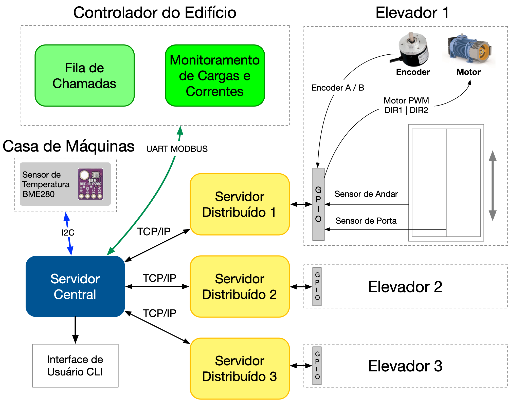

# Trabalho 1 — Controle de Grupo de Elevadores com Despacho por Destino

Trabalho 1 da disciplina de **Fundamentos de Sistemas Embarcados (2026/2)**

**Datas de Entrega do Trabalho 1 (Turmas Prof. Renato):**
- [Entrega 1](./Entrega_1.md): 22/09/2026
- Entrega 2: 04/10/2026
- Entrega Final: 12/10/2026

## 1. Objetivos

Este trabalho tem por objetivo a criação de um **sistema distribuído de controle** para um grupo de elevadores de um edifício comercial de **6 andares** servido por **3 cabines**. O aluno deve desenvolver, na **Raspberry Pi**, os programas que controlam e coordenam as cabines do simulador via **GPIO**, **UART/MODBUS RTU** e **I2C**.

O edifício opera em **Despacho por Destino** (*Destination Control*): não existem botões de sobe/desce nos andares. O passageiro declara **origem e destino** num quiosque do lobby e o sistema decide **qual cabine** atenderá aquela viagem. É o paradigma adotado comercialmente por sistemas como Otis Compass, Schindler PORT e KONE DX.

O sistema é composto por um **Servidor Central** e **três Servidores Distribuídos** (um por cabine), todos executados como processos independentes na Raspberry Pi. O simulador do edifício é executado em uma ESP32, em conjunto com um dashboard em tempo real (Web) que exibe as cabines, registra as chamadas dos passageiros e mede o desempenho do grupo.

Serão abordados neste trabalho:

- Leitura e escrita em GPIO;
- Entrada por GPIO com **tratamento de interrupções** (encoders em quadratura e cortina de luz);
- Saída por GPIO em **liga/desliga e PWM**;
- Leitura do **barramento I2C**;
- Comunicação **UART** com o protocolo **MODBUS RTU**;
- **Controle em malha fechada** com PID sobre um sistema físico simulado;
- **Serviços distribuídos** cooperando por TCP/IP para o controle efetivo do processo.

A **Figura 1** ilustra a arquitetura geral do sistema:



## 2. Arquitetura do Sistema

### 2.1 Servidor Central

Processo único. É o **único** processo autorizado a abrir a porta serial (`/dev/serial0`) e o barramento I2C. Responsabilidades:

- Manter conexão **TCP/IP** com os três Servidores Distribuídos;
- Ler o sensor **BMP280** via I2C e escrever a **Condição de Contorno** (temperatura e pressão ambiente) no simulador via MODBUS, periodicamente;
- Ler a capacidade instantânea do **Barramento de Potência** e reparti-la em **Cotas de Potência**, uma por cabine, enviadas por TCP/IP;
- Ler a **fila de Chamadas de Destino** via MODBUS e executar o **Despacho**: atribuir cada chamada a exatamente uma cabine, informando a atribuição ao simulador e ao Servidor Distribuído correspondente;
- Manter **log persistente** das viagens (id da chamada, origem, destino, cabine atribuída, instante do registro, instante do embarque, instante do desembarque);
- Prover **interface** (terminal) com o estado consolidado das três cabines e as métricas do grupo, permitindo ainda o **comando manual** de envio de uma cabine a um andar;
- **Armazenar de modo persistente** o estado atual, de forma que possa ser restabelecido após reinicialização.

### 2.2 Servidores Distribuídos (Cabines 1, 2 e 3)

Três processos, um por cabine. Cada um é o **único** processo autorizado a tocar as GPIOs da sua cabine. Responsabilidades:

- Fechar a **malha de posição** da cabine com um controlador **PID**, atuando sobre o motor de tração via **PWM** e pinos de direção;
- Ler o **encoder em quadratura** da cabine **por interrupção** de GPIO, resolvendo sentido e deslocamento;
- Ler o **Sensor de Andar** da cabine **por interrupção** de GPIO e executar a **Calibração** das posições dos 6 andares antes de assumir o controle (Seção 3.3);
- **Reancorar** a posição no valor calibrado a cada passagem por uma bandeirola, corrigindo a deriva do contador de quadratura (Seção 3.3);
- Ler a **cortina de luz** da porta **por interrupção** de GPIO, impedindo o fechamento sob obstrução;
- **Saturar a saída do PID** pela Cota de Potência vigente, recebida do Servidor Central;
- Entrar em **Modo Degradado** quando não houver Cota válida vigente (Seção 7.3);
- Executar as viagens atribuídas pelo Despacho, respeitando a sequência de paradas;
- Configurar-se automaticamente para a cabine 1, 2 ou 3 a partir de um **arquivo de configuração** (pinos, endereço MODBUS, porta TCP).

### 2.3 Dashboard (ThingsBoard)

O dashboard exibe o edifício e é o **quiosque de destino**: o operador registra chamadas informando origem e destino, ou dispara um **Cenário de Tráfego** pré-definido (Seção 7.6). As chamadas chegam à Raspberry Pi pela fila MODBUS do dispositivo `0x20`.

## 3. Conexões GPIO (Raspberry Pi)

São **7 pinos por cabine**, 21 no total. O critério da divisão entre GPIO e MODBUS é: **a GPIO leva o que exige interrupção ou baixa latência; o MODBUS leva dado estruturado e analógico.**

> ⚠️ **As colunas das Cabines 1 e 2 foram trocadas.**

<center>
<b>Tabela 1</b> - Pinos GPIO (BCM) por cabine — ⚠️ **Atualizado.**
</center>

<center>

| Sinal | Cabine 1 | Cabine 2 | Cabine 3 | Direção |
|:--|:-:|:-:|:-:|:-:|
| `PWM` — potência do motor de tração | 13 | 11 | 18 | OUT |
| `DIR1` — direção 1                  | 22 | 17 | 24 | OUT |
| `DIR2` — direção 2                  | 23 | 27 | 25 | OUT |
| `ENC_A` — encoder canal A           | 20 | 5  | 7  | IN |
| `ENC_B` — encoder canal B           | 21 | 6  | 8  | IN |
| `CORTINA` — cortina de luz da porta | 26 | 16 | 19 | IN |
| `SENSOR_ANDAR` — bandeirola de andar | 0 | 12 | 1  | IN |

</center>

### 3.1 Motor de Tração

O motor é acionado por **PWM a 1 kHz** (sugestão: `softPwm` da WiringPi, ou equivalente na linguagem escolhida), com intensidade de 0 a 100%. A direção é dada pelos pinos `DIR1` e `DIR2`:

<center>

| Ação | DIR1 | DIR2 |
|:--|:-:|:-:|
| **Livre**       | 0 | 0 |
| **Subir**       | 1 | 0 |
| **Descer**      | 0 | 1 |
| **Freio**       | 1 | 1 |

</center>

> **Atrito estático.** O motor do elevador **não arranca com *duty cycle* abaixo de 10%** — o
> torque de arranque de um motor de tração real é maior que o de regime. Uma vez
> em movimento, qualquer *duty cycle* movimenta o motor.

> **Atenção ao jitter.** O PWM por software é gerado por *bit-banging*, e três canais simultâneos competem pelo escalonador do Linux. O período de PWM (1 ms) é deliberadamente duas ordens de grandeza menor que o período da malha de controle (50 ms), de modo que a variação seja mediada pelo termo integral. **Não** reduza o período da malha de PID tentando "compensar" o jitter — o efeito é o oposto.

### 3.2 Encoder em Quadratura

Cada cabine possui um encoder de dois canais (A e B) em quadratura. A leitura **deve ser feita por interrupção** em ambos os canais — implementações por *polling* em laço não serão aceitas neste item.

- Resolução: **1000 pulsos por metro** de deslocamento, em contagem de quadratura (4×);
- O prédio tem **6 andares** (0 a 5) e o vão **nominal** entre eles é de 3,0 m;
- Curso útil: cerca de **15 m** → **15000 pulsos**, valor **nominal** — o curso real
  varia alguns centímetros de uma cabine para outra;
- Além dos andares extremos há **400 mm de poço** abaixo do andar 0 e **400 mm de
  sobrecurso** acima do andar 5. Abaixo do andar 0 a posição é **negativa**. Use
  esses limites para a proteção de fim de curso.

> Use inteiro de **32 bits com sinal** no contador de posição. A contagem é
> relativa e acumula nos dois sentidos ao longo de toda a operação, e fica
> **negativa** quando a cabine desce abaixo do andar 0, dentro do poço. Não
> confunda com o registrador MODBUS `posicao_mm` (Seção 5.2), que é int16 com
> sinal porque carrega uma posição absoluta instantânea, não um acumulador.

A **tolerância de nivelamento** é de **±10 mm** (isto é, ±10 pulsos). Fora dessa faixa, a cabine é considerada entre andares e a porta não pode abrir.

> **Atenção: 3,0 m é o vão NOMINAL, não a posição real dos andares.** Os andares
> não estão em múltiplos exatos de 3000 mm, e **cada cabine tem os seus**. Assumir
> `posição = 3000 × andar` erra por muito mais que a tolerância de nivelamento e
> a porta nunca abre. As posições reais têm de ser medidas — ver a Seção 3.3.

### 3.3 Sensor de Andar e Calibração

Cada cabine possui um **Sensor de Andar**: uma entrada on/off que fica ativa
enquanto a cabine está dentro da **bandeirola** de um andar. A bandeirola é uma
região do poço centrada na posição real do andar, e é **muito mais larga que a
tolerância de nivelamento** — parar assim que o sensor sobe **não** deixa a
cabine nivelada.

Antes de assumir o controle do prédio, cada Servidor Distribuído deve executar um
**procedimento de calibração** e levantar a posição dos 6 andares da sua cabine:

1. Detectar **por interrupção** as duas bordas do Sensor de Andar — a de entrada
   e a de saída da bandeirola — registrando a contagem do encoder em cada uma;
2. A posição do andar é a **média** entre as duas bordas. Uma borda só não basta:
   **a largura da bandeirola é desconhecida e diferente em cada andar de cada
   cabine**, então não há como deduzir o centro a partir de uma extremidade;
3. Repetir numa varredura de **subida** e numa de **descida**, e tirar a média
   das duas. Isso cancela o erro que depende do sentido (latência de
   interrupção, quantização da contagem);
4. Descobrir **a qual andar** pertence cada bandeirola lendo o registrador MODBUS
   `0` (`andar_atual`), que devolve o andar mais próximo.

O poço se estende **abaixo do andar 0 e acima do andar 5**, de modo que a cabine
consegue atravessar por inteiro também as bandeirolas dos andares extremos.

**O Sensor de Andar não serve só na partida — use-o como referência contínua.**
Um contador de quadratura em software acumula erro ao longo do curso, sobretudo
nas inversões de sentido: medido nesta bancada, a contagem da Raspberry Pi
escorrega cerca de 25 mm em relação à posição real depois de uma sequência de
viagens pelo poço inteiro. Isso é mais que o dobro da tolerância de nivelamento,
e nenhuma calibração inicial sobrevive a ele. A solução é a mesma do elevador
real: **a cada passagem por uma bandeirola, reancore a posição** no valor
calibrado daquele andar. A bandeirola é uma referência absoluta; a contagem do
encoder é relativa e deriva.

> **A calibração deve sair de interrupção no Sensor de Andar.** Determinar a
> posição dos andares sondando por *polling* o registrador `1` (`nivelado`)
> **zera este item**, pela mesma razão que o *polling* já é vetado na leitura do
> encoder.

### 3.4 Cortina de Luz

Sinal normalmente em **baixa**, ativado em **alta** enquanto houver obstrução na porta. Deve ser tratado **por interrupção**, com *debounce*. Enquanto ativo, o comando de fechamento de porta deve ser inibido e o fechamento reiniciado quando a obstrução cessar.

## 4. Barramento I2C

<center>

| Dispositivo | Endereço | Função |
|:--|:-:|:--|
| **BMP280** | `0x76` | Temperatura e pressão da casa de máquinas |

</center>

O BMP280 é um sensor **real**, montado no shield da Raspberry Pi — não é simulado pela ESP32. Sua leitura é a **Condição de Contorno** do modelo físico: a temperatura da casa de máquinas determina, por derating térmico, a capacidade instantânea do Barramento de Potência do edifício (Seção 7.4).

Somente o **Servidor Central** acessa o barramento I2C.

## 5. Integração UART — MODBUS RTU

**Parâmetros da porta serial**: 115200 bps, 8N1, timeout de 200 a 500 ms, até 3 tentativas em caso de erro.

Todas as mensagens devem ser enviadas **com CRC** e recebidas **verificando o CRC**. Mensagem com CRC inválido deve ser descartada e a solicitação repetida.

> **Atenção**: é necessário enviar os **6 últimos dígitos da matrícula** ao final de cada mensagem MODBUS, sempre antes do CRC. Cada dígito é o byte cru (`0x00`–`0x09`), não o caractere ASCII.

### 5.1 Endereços dos Dispositivos

<center>

| Dispositivo | Endereço MODBUS | Funções suportadas |
|:--|:-:|:--|
| Cabine 1 | `0x11` | `0x03` leitura / `0x10` escrita |
| Cabine 2 | `0x12` | `0x03` / `0x10` |
| Cabine 3 | `0x13` | `0x03` / `0x10` |
| Controlador do Prédio | `0x20` | `0x03` / `0x10` |

</center>

### 5.2 Mapa de Registradores — Cabines (`0x11` a `0x13`)

**Holding Registers — Função `0x03` (leitura) / `0x10` (escrita)**

<center>

| Offset | Campo | Acesso | Codificação |
|:-:|:--|:-:|:--|
| 0 | `andar_atual`    | R | 0 a 5 (andar mais próximo) |
| 1 | `nivelado`       | R | 0 = entre andares, 1 = nivelado dentro de ±10 mm |
| 2 | `porta_estado`   | R | 0=fechada, 1=abrindo, 2=aberta, 3=fechando, 4=obstruída |
| 3 | `porta_comando`  | W | 0=nenhum, 1=abrir, 2=fechar |
| 4 | `corrente_ma`    | R | corrente instantânea do motor, em mA |
| 5 | `carga_kg`       | R | carga a bordo, em kg |
| 6 | `passageiros`    | R | número de passageiros a bordo |
| 7 | `posicao_mm`     | R | posição absoluta em mm, **int16 com sinal** (negativa no poço) — **atualizado a 1 Hz** |
| 8 | `falha`          | R | máscara de bits de falha (0 = sem falha) |

</center>

> **O registrador `posicao_mm` existe apenas para conferência e depuração.** Sua taxa de atualização de 1 Hz é insuficiente para realimentar a malha de controle. **Usá-lo no lugar do encoder zera o item de PID da avaliação.**

### 5.3 Mapa de Registradores — Controlador do Prédio (`0x20`)

**Holding Registers — Função `0x03` (leitura) / `0x10` (escrita)**

<center>

| Offset | Campo | Acesso | Codificação |
|:-:|:--|:-:|:--|
| 0  | `chamadas_na_fila`      | R | número de Chamadas de Destino pendentes |
| 1  | `chamada_origem`        | R | andar de origem da chamada na cabeça da fila (0 a 5) |
| 2  | `chamada_destino`       | R | andar de destino (0 a 5) |
| 3  | `chamada_id`            | R | identificador sequencial da chamada na cabeça da fila |
| 4  | `chamada_pop`           | W | escrever 1 remove a chamada da cabeça da fila |
| 5  | `ambiente_temp_c_x10`   | **W** | **Condição de Contorno** — temperatura em décimos de °C |
| 6  | `ambiente_press_hpa`    | **W** | **Condição de Contorno** — pressão em hPa |
| 7  | `barramento_max_ma`     | R | capacidade instantânea do Barramento de Potência, em mA |
| 8  | `watchdog_ambiente`     | R | 0 = Condição de Contorno válida, 1 = expirada (piso ativo) |
| 9  | `atribuicao_chamada_id` | W | id da chamada sendo atribuída |
| 10 | `atribuicao_cabine`     | W | cabine atribuída (1 a 3) |
| 11 | `cenario_ativo`         | R | 0=nenhum, 1=up-peak, 2=down-peak, 3=interfloor |
| 12 | `cenario_geradas`       | R | chamadas geradas no cenário corrente |
| 13 | `cenario_atendidas`     | R | chamadas concluídas no cenário corrente |
| 14 | `espera_media_s_x10`    | R | tempo médio de espera, em décimos de segundo |
| 15 | `viagem_media_s_x10`    | R | tempo médio de viagem, em décimos de segundo |

</center>

**Fluxo de consumo de uma Chamada de Destino:**

1. O Servidor Central lê `chamadas_na_fila` (offset 0). Se for zero, nada a fazer;
2. Lê `chamada_origem`, `chamada_destino` e `chamada_id` (offsets 1 a 3);
3. Executa o algoritmo de Despacho e escolhe a cabine;
4. Escreve `atribuicao_chamada_id` e `atribuicao_cabine` (offsets 9 e 10) via `0x10`;
5. Escreve **1** em `chamada_pop` (offset 4) para retirar a chamada da fila;
6. Comunica a atribuição ao Servidor Distribuído correspondente via TCP/IP.

## 6. Requisitos do Sistema

### 6.1 Servidores Distribuídos

O código pode ser desenvolvido em **C/C++**, **Python** ou **Rust**.

1. **Controlar a posição da cabine** com um controlador PID (Seção 7.1), atuando sobre o PWM de tração e os pinos de direção, com período de malha de **50 ms**;
2. **Ler o encoder por interrupção** em ambos os canais, resolvendo sentido e deslocamento;
3. **Calibrar as Posições de Andar** na partida, lendo o **Sensor de Andar por interrupção** nas duas bordas de cada bandeirola, em uma varredura de subida e uma de descida (Seção 3.3). Determinar as posições por *polling* do registrador MODBUS `1` (`nivelado`) **não é aceito**;
4. **Reancorar a posição** no valor calibrado a cada passagem por uma bandeirola, mantendo o erro dentro da tolerância ao longo de toda a operação (Seção 3.3);
5. **Ler a cortina de luz por interrupção**, com debounce, inibindo o fechamento da porta sob obstrução;
6. **Saturar a saída do PID** pela Cota de Potência vigente (Seção 7.2);
7. **Entrar em Modo Degradado** quando não houver Cota válida (Seção 7.3);
8. Parar nos andares dentro da tolerância de **±10 mm**, abrir a porta, aguardar o embarque/desembarque e fechar a porta;
9. Reportar periodicamente ao Servidor Central (a cada **500 ms**) posição, andar, sentido, estado da porta e corrente instantânea;
10. Configurar-se para a cabine 1, 2 ou 3 a partir de **arquivo de configuração**.

### 6.2 Servidor Central

1. **Manter conexão TCP/IP** com os três Servidores Distribuídos;
2. **Ler o BMP280 via I2C** e escrever a Condição de Contorno no dispositivo `0x20` a cada **5 segundos, no máximo** (Seção 7.4);
3. **Ler a fila de Chamadas de Destino** via MODBUS e executar o **Despacho** (Seção 7.5);
4. **Repartir o Barramento de Potência** em Cotas por cabine, respeitando `barramento_max_ma`, e renovar as Cotas a cada **1 segundo** (Seção 7.2);
5. Manter **log persistente** das viagens, com os instantes de registro, embarque e desembarque de cada chamada;
6. Prover **interface de terminal** com: estado das três cabines (andar, sentido, porta, corrente, Cota vigente); capacidade do barramento e watchdog; chamadas pendentes e atribuídas; tempo médio de espera e de viagem; e comando manual para enviar uma cabine a um andar;
7. **Persistir o estado** para restabelecimento após reinicialização.

### 6.3 Requisitos Gerais

1. Deve haver instruções explícitas de instalação e execução, em qualquer linguagem;
2. Para C/C++, é mandatório o uso de **Makefile** com todas as dependências no projeto;
3. Cada serviço deve poder ser **iniciado independentemente**, em qualquer ordem, aguardando a conexão dos demais;
4. Qualquer queda de comunicação deve ser **restabelecida automaticamente**, sem perda de função;
5. Não pode haver laços que ocupem 100% de CPU (*busy-wait*);
6. O programa deve tratar **SIGINT** (Ctrl+C) encerrando as comunicações com os periféricos (UART / I2C / GPIO) e **desligando os atuadores** (PWM dos motores em zero, direção em freio);
7. O código deve ser **modular**, com arquitetura bem definida. Programas completos em arquivo único terão a nota de qualidade zerada;
8. O repositório deve conter **README** com instalação, configuração, uso e os gráficos dos experimentos.

## 7. Detalhes de Implementação

### 7.1 Controle PID de Posição

A variável de processo é a **posição da cabine**, medida pelo encoder; a referência é a **posição do andar de destino**; o erro é `Erro = PosRef − PosAtual`. A saída do PID é convertida em intensidade de PWM (0 a 100%) e sentido de direção.

Valores sugeridos para as constantes, como ponto de partida:

- **Kp** = 0,5
- **Ki** = 0,05
- **Kd** = 40,0

O aluno está livre para sintonizar outros valores mais adequados, e deve **documentar no README** o processo de sintonia com os gráficos correspondentes.

A partida do motor deve ser feita com **rampa de aceleração**, e não em degrau — tanto por conforto do passageiro simulado quanto para não violar a Cota de Potência no transitório.

> **A rampa tem de vencer o Atrito Estático** (Seção 3.1): partindo da imobilidade, duty abaixo de **10%** não move a cabine. Uma rampa de 0 a 100% em um segundo cruza esse piso em 100 ms e não sente o efeito. Já um PID que responda a um erro pequeno com duty de 5% deixa a cabine **parada e sem erro de rastreamento aparente**, enquanto o termo integral cresce — cuidado com o *windup* nessa condição.

### 7.2 Barramento de Potência e Cota

As três cabines compartilham um **único barramento elétrico**. Em regime nominal:

- Capacidade do barramento a 25 °C: **12000 mA**;
- Corrente máxima de uma cabine em aceleração plena: **6000 mA**.

Três cabines acelerando simultaneamente demandariam 18000 mA — **50% acima da capacidade**. O barramento, portanto, **não comporta as três cabines em aceleração ao mesmo tempo**, e é o Servidor Central quem decide como reparti-lo.

**Cota de Potência** é o limite de corrente, em mA, que o Servidor Central concede a uma cabine. O Servidor Distribuído converte a Cota em limite de PWM:

```
duty_max [%] = (cota_ma / 6000) × 100
```

e **satura a saída do PID** nesse limite. A soma das Cotas concedidas nunca pode exceder `barramento_max_ma`.

Cada Cota tem **validade de 2 segundos**. O Servidor Central deve renová-las a cada 1 segundo. Uma cabine que não receba renovação dentro da validade entra em Modo Degradado.

### 7.3 Modo Degradado

Uma cabine sem Cota válida vigente **não pode arbitrar potência para si mesma**. Ela deve:

1. Desacelerar imediatamente para a **velocidade mínima**, correspondente a uma Cota de **1000 mA**;
2. Prosseguir até o **próximo andar no sentido atual** de movimento;
3. Nivelar dentro da tolerância, parar e **abrir a porta**;
4. Permanecer parada com a porta aberta até receber uma Cota válida.

Esse é o comportamento de resgate de elevadores reais em falha de alimentação: nunca deixar passageiro preso entre andares.

### 7.4 Condição de Contorno e Watchdog

O Servidor Central lê o BMP280 e escreve temperatura e pressão nos offsets 5 e 6 do dispositivo `0x20`. O simulador aplica **derating térmico** sobre a capacidade do barramento:

```
barramento_max_ma = 12000 − 200 × max(0, T_ambiente[°C] − 25)
```

Ou seja: a 25 °C o barramento entrega 12000 mA; a 35 °C, apenas 10000 mA.

O simulador mantém um **watchdog** sobre esses registradores. Se a Condição de Contorno não for reescrita dentro de **30 segundos**, o simulador assume falha de instrumentação, sinaliza `watchdog_ambiente = 1` e **limita o barramento a um piso conservador de 3000 mA** — o que reduz as três cabines à velocidade mínima.

> Um sistema que não implemente a cadeia I2C → MODBUS **não move o edifício**. Isso é intencional.

### 7.5 Despacho por Destino

O Servidor Central atribui cada Chamada de Destino a **exatamente uma** cabine. A atribuição é definitiva: uma vez informada ao simulador, não pode ser transferida.

**Invariantes obrigatórios** (verificados na avaliação):

- Toda chamada retirada da fila é atribuída a uma cabine e efetivamente atendida;
- Nenhuma chamada permanece sem embarque por mais de **90 segundos**;
- A soma das Cotas concedidas nunca excede `barramento_max_ma`;
- Nenhuma cabine abre a porta fora da tolerância de nivelamento;
- Nenhuma cabine ultrapassa a Cota concedida.

A **estratégia** de atribuição é livre — do trivial "cabine mais próxima" até agrupamento de passageiros com destinos coincidentes. A qualidade da estratégia é medida pelos cenários da Seção 7.6.

### 7.6 Cenários de Tráfego

O widget dispara cenários com **semente determinística**, de modo que todos os grupos sejam avaliados sobre a mesma sequência de chamadas:

<center>

| Cenário | `cenario_ativo` | Perfil |
|:--|:-:|:--|
| **Up-peak**    | 1 | 80% das chamadas com origem no térreo — chegada matinal |
| **Down-peak**  | 2 | 80% das chamadas com destino no térreo — saída no fim do expediente |
| **Interfloor** | 3 | Origem e destino uniformemente distribuídos |

</center>

Cada cenário dura **5 minutos**. Ao final, o simulador consolida `espera_media_s_x10` e `viagem_media_s_x10`.

O **tempo de espera** é medido do registro da chamada até a porta abrir no andar de origem. O **tempo de viagem**, do embarque até a porta abrir no andar de destino.

> Os parâmetros numéricos do barramento, do derating e das metas de tempo serão **calibrados e confirmados** contra o firmware antes da Entrega Final.

## 8. Critérios de Avaliação

### Entrega

- Repositório (no GitHub Classroom) incluindo README com instruções de execução (para C/C++, com Makefile);
- Vídeo de até 10 min mostrando o sistema em funcionamento e destacando as partes mais importantes do código. Atenção: a gravação do vídeo deve ser feita com a câmera ligada mostrando o rosto dos estudantes.

<center>
<b>Tabela 2</b> - Critérios de Avaliação
</center>

| ITEM | DETALHE | VALOR |
|:--|:--|:-:|
| **Entrega 1 — Módulo da GPIO** | | |
| Módulo da GPIO | Módulo capaz de controlar a GPIO com entradas (por polling e por interrupção) e saídas (liga/desliga e PWM). | 1,0 |
| **Entrega 2 — Módulos UART-MODBUS e I2C** | | |
| Módulo UART / MODBUS | Módulo capaz de enviar e receber comandos pela UART via protocolo MODBUS RTU conforme a Seção 5, com verificação de CRC e retentativas. | 1,0 |
| Módulo I2C e Condição de Contorno | Leitura do BMP280 e escrita da Condição de Contorno no simulador, mantendo o watchdog satisfeito. | 0,5 |
| **Entrega Final** | | |
| Controle PID de Posição | Implementação correta do PID sobre PWM e direção, com leitura do encoder por interrupção, nivelamento dentro de ±10 mm e rampa de aceleração. | 1,5 |
| Calibração e Sensor de Andar | Leitura do Sensor de Andar por interrupção, levantamento das Posições de Andar pela média das duas bordas em varredura de subida e de descida, e reancoragem da posição a cada passagem por uma bandeirola (Seção 3.3). Calibração por *polling* do registrador `nivelado` zera este item. | 0,5 |
| Cota de Potência e Modo Degradado | Saturação correta do PID pela Cota, respeito ao Barramento de Potência e pouso de emergência correto no Teste 1. | 1,0 |
| Despacho por Destino | Invariantes da Seção 7.5 satisfeitos, e desempenho nos três Cenários de Tráfego medido por tempo médio de espera. | 1,5 |
| Comunicação TCP/IP | Comunicação correta entre os quatro processos, inicialização em qualquer ordem e reconexão automática sem perda de função. | 1,0 |
| Qualidade do Código | Bons nomes, modularização, arquitetura definida, ausência de busy-wait e tratamento correto de SIGINT. | 1,5 |
| README com Experimentos | Instruções de compilação e uso, sintonia do PID documentada e gráficos dos experimentos. | 0,5 |
| **Pontuação Extra** | Qualidade e usabilidade acima da média. | 0,5 |

> Os itens da Entrega Final somam **7,5**, que com os **2,5** das Entregas 1 e 2 fecham a nota de **10,0**; a Pontuação Extra é adicional.
> **Sem Calibração a cabine não abre porta nenhuma**, então o item de Controle PID e o de Despacho por Destino ficam inacessíveis na prática — o peso de 0,5 mede a implementação do procedimento, não a sua importância.

## 10. Referências

### Bibliotecas Python

- [gpiozero](https://gpiozero.readthedocs.io)
- [RPi.GPIO](https://pypi.org/project/RPi.GPIO/) — [Exemplos](https://sourceforge.net/p/raspberry-gpio-python/wiki/Examples/)
- [pyserial](https://pyserial.readthedocs.io) — comunicação serial / MODBUS
- [smbus2](https://pypi.org/project/smbus2/) — barramento I2C

### Bibliotecas C/C++

- [WiringPi](http://wiringpi.com/) — GPIO e `softPwm`
- [BCM2835](http://www.airspayce.com/mikem/bcm2835/)
- [PiGPIO](http://abyz.me.uk/rpi/pigpio/index.html)
- [libmodbus](https://libmodbus.org/)
- [Driver da Bosch para o sensor BMP280](https://github.com/BoschSensortec/BMP2-Sensor-API/)

### Protocolo MODBUS

- [MODBUS Application Protocol v1.1b3](https://modbus.org/docs/Modbus_Application_Protocol_V1_1b3.pdf)
- Funções utilizadas: `0x03` Read Holding Registers, `0x10` Write Multiple Registers

### Controle

- [Controle PID — Wikipedia](https://pt.wikipedia.org/wiki/Controlador_proporcional_integral_derivativo)
- [Controle Liga/Desliga — Wikipedia](https://pt.wikipedia.org/wiki/Controle_liga-desliga)

### Despacho por Destino

- Barney, G. C.; Al-Sharif, L. *Elevator Traffic Handbook: Theory and Practice*. 2ª ed., Routledge, 2016.

### Lista de Exemplos

Há um compilado de exemplos de acesso à GPIO em várias linguagens (C, C#, Ruby, Perl, Python, Java e Shell): https://elinux.org/RPi_GPIO_Code_Samples

### Links dos Dashboards

[Dashboard rasp36](https://tb.fse.lappis.rocks/dashboard/08263b80-b11c-11f1-9a0b-0359851b5c05?publicId=86d17ff0-e010-11ef-9ab8-4774ff1517e8)   
[Dashboard rasp37](https://tb.fse.lappis.rocks/dashboard/33a46b10-b11c-11f1-9a0b-0359851b5c05?publicId=86d17ff0-e010-11ef-9ab8-4774ff1517e8)   
[Dashboard rasp40](https://tb.fse.lappis.rocks/dashboard/cd3a92b0-b11a-11f1-9a0b-0359851b5c05?publicId=86d17ff0-e010-11ef-9ab8-4774ff1517e8)   
[Dashboard rasp41](https://tb.fse.lappis.rocks/dashboard/172ca070-b11b-11f1-9a0b-0359851b5c05?publicId=86d17ff0-e010-11ef-9ab8-4774ff1517e8)   
[Dashboard rasp42](https://tb.fse.lappis.rocks/dashboard/2f3c9990-b11b-11f1-9a0b-0359851b5c05?publicId=86d17ff0-e010-11ef-9ab8-4774ff1517e8)   
[Dashboard rasp43](https://tb.fse.lappis.rocks/dashboard/5890e440-b11b-11f1-9a0b-0359851b5c05?publicId=86d17ff0-e010-11ef-9ab8-4774ff1517e8)   
[Dashboard rasp44](https://tb.fse.lappis.rocks/dashboard/735d6550-b11b-11f1-9a0b-0359851b5c05?publicId=86d17ff0-e010-11ef-9ab8-4774ff1517e8)   
[Dashboard rasp45](https://tb.fse.lappis.rocks/dashboard/c190b2e0-acc0-11f1-9a0b-0359851b5c05?publicId=86d17ff0-e010-11ef-9ab8-4774ff1517e8)  
[Dashboard rasp46](https://tb.fse.lappis.rocks/dashboard/db9772f0-acc0-11f1-9a0b-0359851b5c05?publicId=86d17ff0-e010-11ef-9ab8-4774ff1517e8)  
[Dashboard rasp47](https://tb.fse.lappis.rocks/dashboard/8ceb24d0-b11b-11f1-9a0b-0359851b5c05?publicId=86d17ff0-e010-11ef-9ab8-4774ff1517e8)   
[Dashboard rasp48](https://tb.fse.lappis.rocks/dashboard/1bbb15e0-acc0-11f1-9a0b-0359851b5c05?publicId=86d17ff0-e010-11ef-9ab8-4774ff1517e8)  
[Dashboard rasp49](https://tb.fse.lappis.rocks/dashboard/8eac4970-acc0-11f1-9a0b-0359851b5c05?publicId=86d17ff0-e010-11ef-9ab8-4774ff1517e8)  
[Dashboard rasp50](https://tb.fse.lappis.rocks/dashboard/aac98d70-acc0-11f1-9a0b-0359851b5c05?publicId=86d17ff0-e010-11ef-9ab8-4774ff1517e8)  
[Dashboard rasp51](https://tb.fse.lappis.rocks/dashboard/a69efa60-a9fe-11f1-9330-eb2c49121367?publicId=86d17ff0-e010-11ef-9ab8-4774ff1517e8)   
[Dashboard rasp52](https://tb.fse.lappis.rocks/dashboard/d39cd4a0-b11b-11f1-9a0b-0359851b5c05?publicId=86d17ff0-e010-11ef-9ab8-4774ff1517e8)   
